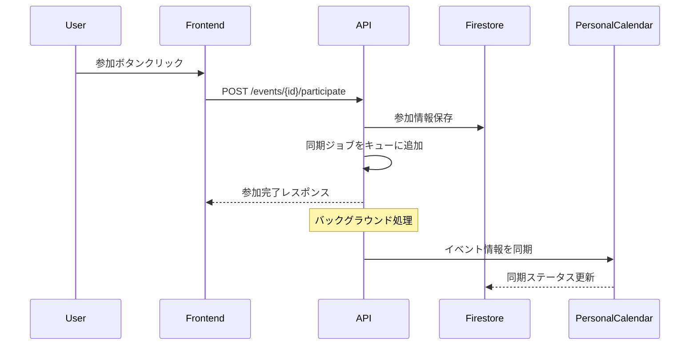

# Rally Net コミュニティ機能 Phase1 アーキテクチャ設計

## 1. システム概要

Rally Netのコミュニティ機能は、バドミントンプレイヤーが練習予定を共有し、参加者を募集し、練習メニューを管理するための包括的なプラットフォームです。

## 2. データモデル設計

### 2.1 拡張が必要な既存の型定義

#### CommunityEvent（新規追加）
```typescript
// src/types/community.ts に追加
export interface CommunityEvent {
  id: string;
  communityId: string;
  title: string;
  description?: string;
  startDateTime: string; // ISO 8601形式
  endDateTime: string;   // ISO 8601形式
  location: string;
  maxParticipants?: number;
  minParticipants?: number;
  createdBy: string;
  createdAt: number;
  updatedAt?: number;
  
  // 練習カード関連
  practiceRoutineId?: string; // 関連する練習ルーティン
  practiceCardIds?: string[]; // 使用する練習カードID
  
  // メタ情報
  tags?: string[];
  difficulty?: 'beginner' | 'intermediate' | 'advanced';
  equipment?: string[];
  notes?: string;
  
  // ステータス
  status: EventStatus;
  isCancelled?: boolean;
  cancellationReason?: string;
}

export enum EventStatus {
  DRAFT = 'draft',
  PUBLISHED = 'published',
  IN_PROGRESS = 'in_progress',
  COMPLETED = 'completed',
  CANCELLED = 'cancelled'
}
```

#### EventParticipation（新規追加）
```typescript
export interface EventParticipation {
  id: string;
  eventId: string;
  userId: string;
  status: AttendanceStatus;
  registeredAt: number;
  updatedAt?: number;
  
  // 個人カレンダー同期
  syncedToCalendar: boolean;
  personalCalendarId?: string;
  lastSyncAt?: number;
  
  // 追加情報
  comment?: string;
  notificationSettings?: ParticipantNotificationSettings;
}

export enum AttendanceStatus {
  ATTENDING = 'attending',      // 参加
  NOT_ATTENDING = 'not_attending', // 不参加
  MAYBE = 'maybe',              // 未定
  WAITING = 'waiting'           // キャンセル待ち
}

export interface ParticipantNotificationSettings {
  reminder24h: boolean;
  reminder1h: boolean;
  changesNotification: boolean;
}
```

#### EventComment（新規追加）
```typescript
export interface EventComment {
  id: string;
  eventId: string;
  userId: string;
  userName?: string;
  userPhotoURL?: string;
  content: string;
  createdAt: number;
  updatedAt?: number;
  
  // リプライ機能
  parentCommentId?: string;
  replies?: EventComment[];
  
  // リアクション
  reactions?: CommentReaction[];
}

export interface CommentReaction {
  userId: string;
  emoji: string;
  createdAt: number;
}
```

#### CalendarSync（新規追加）
```typescript
export interface CalendarSync {
  id: string;
  userId: string;
  eventId: string;
  
  // 同期情報
  syncStatus: SyncStatus;
  lastSyncAt: number;
  nextSyncAt?: number;
  
  // エラー処理
  syncErrors?: SyncError[];
  retryCount: number;
}

export enum SyncStatus {
  PENDING = 'pending',
  SYNCED = 'synced',
  FAILED = 'failed',
  CANCELLED = 'cancelled'
}

export interface SyncError {
  timestamp: number;
  message: string;
  code?: string;
}
```

## 3. Firebase コレクション構造

### 3.1 メインコレクション

```
firestore/
├── communities/
│   └── {communityId}/
│       ├── events/
│       │   └── {eventId}
│       ├── members/
│       │   └── {userId}
│       └── settings/
│           └── calendar
│
├── event_participations/
│   └── {participationId}
│       
├── event_comments/
│   └── {eventId}/
│       └── comments/
│           └── {commentId}
│
├── calendar_syncs/
│   └── {userId}/
│       └── syncs/
│           └── {syncId}
│
└── users/
    └── {userId}/
        └── personal_calendar/
            └── {eventId}
```

### 3.2 インデックス設計

```javascript
// Firestore複合インデックス
- communities/{communityId}/events
  - createdBy + startDateTime (DESC)
  - status + startDateTime (DESC)
  
- event_participations
  - eventId + status
  - userId + status + eventId
  
- calendar_syncs/{userId}/syncs
  - syncStatus + nextSyncAt
```

## 4. API エンドポイント設計

### 4.1 イベント管理

```typescript
// /src/app/api/community/events/route.ts
POST   /api/community/events          // イベント作成
GET    /api/community/events          // イベント一覧取得
GET    /api/community/events/[id]     // イベント詳細取得
PUT    /api/community/events/[id]     // イベント更新
DELETE /api/community/events/[id]     // イベント削除

// /src/app/api/community/events/[id]/participate/route.ts
POST   /api/community/events/[id]/participate   // 参加登録
PUT    /api/community/events/[id]/participate   // 参加状態更新
DELETE /api/community/events/[id]/participate   // 参加キャンセル

// /src/app/api/community/events/[id]/comments/route.ts
POST   /api/community/events/[id]/comments      // コメント投稿
GET    /api/community/events/[id]/comments      // コメント一覧
```

### 4.2 カレンダー同期

```typescript
// /src/app/api/calendar/sync/route.ts
POST   /api/calendar/sync              // 手動同期トリガー
GET    /api/calendar/sync/status       // 同期ステータス確認

// /src/app/api/calendar/events/route.ts
GET    /api/calendar/events            // 個人カレンダーイベント取得
```

## 5. コンポーネント構造

### 5.1 ページ構造

```
/src/app/
├── community/
│   ├── page.tsx                     // コミュニティ一覧
│   ├── [communityId]/
│   │   ├── page.tsx                 // コミュニティ詳細
│   │   ├── calendar/
│   │   │   └── page.tsx             // コミュニティカレンダー
│   │   ├── events/
│   │   │   ├── page.tsx             // イベント一覧
│   │   │   ├── new/
│   │   │   │   └── page.tsx         // イベント作成
│   │   │   └── [eventId]/
│   │   │       ├── page.tsx         // イベント詳細
│   │   │       └── edit/
│   │   │           └── page.tsx     // イベント編集
│   │   └── settings/
│   │       └── page.tsx             // コミュニティ設定
```

### 5.2 コンポーネント構造

```
/src/components/community/
├── CommunityLayout.tsx              // コミュニティ共通レイアウト
├── CommunityCalendar.tsx            // カレンダービュー
├── EventList.tsx                    // イベントリスト
├── EventCard.tsx                    // イベントカード
├── EventForm.tsx                    // イベント作成/編集フォーム
├── EventDetail.tsx                  // イベント詳細
├── AttendanceManager.tsx            // 出欠管理
├── EventComments.tsx                // コメントセクション
├── PracticeCardSelector.tsx         // 練習カード選択
└── CalendarSyncStatus.tsx           // 同期ステータス表示
```

## 6. Context とState管理

### 6.1 CommunityContext

```typescript
// /src/context/CommunityContext.tsx
interface CommunityContextType {
  // 現在のコミュニティ
  currentCommunity: Community | null;
  
  // イベント関連
  events: CommunityEvent[];
  upcomingEvents: CommunityEvent[];
  myEvents: CommunityEvent[];
  
  // 参加状態
  participations: Map<string, EventParticipation>;
  
  // アクション
  createEvent: (event: Partial<CommunityEvent>) => Promise<void>;
  updateAttendance: (eventId: string, status: AttendanceStatus) => Promise<void>;
  syncCalendar: () => Promise<void>;
  
  // ローディング状態
  isLoading: boolean;
  error: Error | null;
}
```

## 7. カレンダー同期アーキテクチャ

### 7.1 同期フロー



### 7.2 同期ルール

- **追加**: 参加ステータスが「参加」の場合のみ個人カレンダーに追加
- **更新**: イベント情報が変更された場合、参加者の個人カレンダーも更新
- **削除**: 参加ステータスが「不参加」に変更、またはイベントがキャンセルされた場合削除
- **頻度**: リアルタイムではなく、5分間隔のバッチ処理

## 8. UI/UXデザイン方針

### 8.1 レスポンシブデザイン

- モバイルファースト設計
- タブレット、デスクトップ対応
- タッチ操作最適化

### 8.2 アクセシビリティ

- WAI-ARIA準拠
- キーボードナビゲーション対応
- スクリーンリーダー対応

## 9. セキュリティ考慮事項

### 9.1 認証・認可

- Firebase Authentication使用
- コミュニティメンバーのみアクセス可能
- イベント作成者とadminのみ編集権限

### 9.2 データ検証

- フロントエンド・バックエンド両方で入力検証
- XSS対策（サニタイゼーション）
- SQLインジェクション対策（Firestore使用により自動対応）

## 10. パフォーマンス最適化

### 10.1 データフェッチ戦略

- ページネーション実装
- 無限スクロール対応
- キャッシュ戦略（SWR使用）

### 10.2 レンダリング最適化

- React Server Components活用
- 動的インポート
- 画像最適化（Next.js Image使用）

## 11. テスト戦略

### 11.1 単体テスト

- コンポーネントテスト（React Testing Library）
- API エンドポイントテスト
- ユーティリティ関数テスト

### 11.2 統合テスト

- E2Eテスト（Playwright）
- Firebase エミュレータ使用

## 12. デプロイメント

### 12.1 環境構成

- Development: ローカル開発環境
- Staging: テスト環境
- Production: 本番環境

### 12.2 CI/CD

- GitHub Actions使用
- 自動テスト実行
- Vercelへの自動デプロイ

## 13. 今後の拡張計画（Phase2以降）

- プッシュ通知機能
- イベントテンプレート機能
- 繰り返しイベント対応
- 外部カレンダー連携（Google Calendar、iCal）
- イベント分析・統計機能